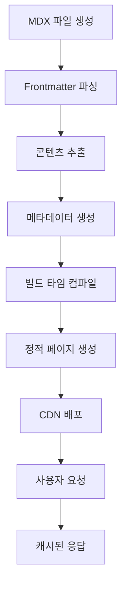

# LeeGyuHa Blog - 시스템 설계 명세서

## 📋 설계 개요

### 현재 시스템 분석

- **플랫폼**: Next.js 15 + React 19 RC 기반 개인 기술 블로그
- **아키텍처**: App Router + MDX + 파일시스템 기반 콘텐츠 관리
- **배포**: Vercel 플랫폼, 자동 빌드/배포 파이프라인

### 설계 목표

1. **성능**: 3초 이하 로딩 속도, Core Web Vitals 최적화
2. **SEO**: 구조화 데이터, 동적 OG 이미지, RSS/Atom 피드
3. **개발 경험**: 타입 안전성, 핫 리로딩, MDX 실시간 미리보기
4. **확장성**: 포스트 수 증가에 대응, 다국어 지원 준비
5. **접근성**: WCAG 2.1 AA 준수, 스크린 리더 최적화

---

## 🏗️ 시스템 아키텍처

### Layer 1: 프레젠테이션 레이어

```
┌─────────────────────────────────────────────────┐
│                 Client Layer                    │
├─────────────────────────────────────────────────┤
│  • Next.js App Router (SSG/SSR Hybrid)         │
│  • React 19 RC + TypeScript                    │
│  • Tailwind CSS + 다크/라이트 모드             │
│  • Responsive Design (모바일 퍼스트)           │
└─────────────────────────────────────────────────┘
```

### Layer 2: 콘텐츠 처리 레이어

```
┌─────────────────────────────────────────────────┐
│              Content Processing                 │
├─────────────────────────────────────────────────┤
│  • MDX 파일시스템 (src/posts/[year]/[slug])   │
│  • gray-matter (Frontmatter 파싱)             │
│  • next-mdx-remote (동적 컴파일)               │
│  • 커스텀 MDX 컴포넌트 시스템                  │
└─────────────────────────────────────────────────┘
```

### Layer 3: 데이터 레이어

```
┌─────────────────────────────────────────────────┐
│                 Data Layer                      │
├─────────────────────────────────────────────────┤
│  • 파일시스템 기반 데이터 소스                  │
│  • 빌드 타임 포스트 스캔 및 인덱싱             │
│  • 메타데이터 추출 및 캐싱                      │
│  • 정적 자산 최적화                            │
└─────────────────────────────────────────────────┘
```

### Layer 4: 인프라스트럭처 레이어

```
┌─────────────────────────────────────────────────┐
│               Infrastructure                    │
├─────────────────────────────────────────────────┤
│  • Vercel Edge Runtime                         │
│  • CDN + 이미지 최적화                          │
│  • Analytics & Performance Monitoring          │
│  • 자동 HTTPS, 도메인 관리                     │
└─────────────────────────────────────────────────┘
```

---

## 🔧 핵심 컴포넌트 설계

### 1. 라우팅 시스템

```typescript
/app
├── layout.tsx                  // 루트 레이아웃
├── page.tsx                   // 홈페이지 (포스트 목록)
├── (post)/                    // 포스트 그룹 라우트
│   ├── layout.tsx            // 포스트 전용 레이아웃
│   ├── [year]/[id]/          // 동적 포스트 페이지
│   ├── components/           // MDX 컴포넌트들
│   └── og/[id]/             // 동적 OG 이미지
├── about/page.mdx            // 소개 페이지
├── links/[id]/              // 링크 리디렉션
├── atom/route.ts            // RSS/Atom 피드
├── sitemap.ts              // 동적 사이트맵
└── robots.ts               // SEO 메타데이터
```

### 2. MDX 처리 파이프라인

```typescript
// 데이터 플로우
파일시스템 스캔
    ↓
Frontmatter 파싱 (gray-matter)
    ↓
MDX 콘텐츠 추출
    ↓
동적 컴파일 (next-mdx-remote)
    ↓
커스텀 컴포넌트 매핑
    ↓
HTML 생성 + 메타데이터
```

### 3. 성능 최적화 전략

```typescript
interface PerformanceStrategy {
  // 1. Static Generation
  revalidate: 60; // 60초 ISR

  // 2. 이미지 최적화
  images: {
    minimumCacheTTL: 2678400; // 31일 캐싱
    formats: ["webp", "avif"];
    sizes: [640, 768, 1024, 1280];
  };

  // 3. 폰트 최적화
  fonts: {
    preload: true;
    fallback: "system-ui, sans-serif";
    display: "swap";
  };

  // 4. 번들 최적화
  bundleAnalyzer: true;
  experimental: { turbo: true };
}
```

---

## 🎨 UI/UX 설계 시스템

### 디자인 토큰

```scss
// 색상 시스템
:root {
  --color-primary: #000;
  --color-secondary: #666;
  --color-accent: #0070f3;
  --color-background: #fff;
  --color-surface: #f9f9f9;
}

[data-theme="dark"] {
  --color-primary: #fff;
  --color-secondary: #aaa;
  --color-background: #000;
  --color-surface: #111;
}

// 타이포그래피 스케일
--font-size-xs: 0.75rem; // 12px
--font-size-sm: 0.875rem; // 14px
--font-size-base: 1rem; // 16px
--font-size-lg: 1.125rem; // 18px
--font-size-xl: 1.25rem; // 20px

// 간격 시스템
--space-1: 0.25rem; // 4px
--space-2: 0.5rem; // 8px
--space-3: 0.75rem; // 12px
--space-4: 1rem; // 16px
--space-6: 1.5rem; // 24px
```

### 컴포넌트 계층구조

```typescript
interface ComponentHierarchy {
  // Atomic 컴포넌트
  atoms: ["Button", "Link", "Text", "Image", "Input", "Icon", "Divider"];

  // Molecular 컴포넌트
  molecules: [
    "Navigation",
    "PostCard",
    "SearchBox",
    "SocialShare",
    "AuthorBio",
    "TagList"
  ];

  // Organism 컴포넌트
  organisms: ["Header", "Footer", "PostList", "Sidebar", "CommentSection"];

  // Page 컴포넌트
  pages: ["HomePage", "PostPage", "AboutPage", "ArchivePage", "SearchPage"];
}
```

### 반응형 브레이크포인트

```typescript
const breakpoints = {
  sm: "640px", // 모바일
  md: "768px", // 태블릿
  lg: "1024px", // 데스크톱
  xl: "1280px", // 대형 데스크톱
  "2xl": "1536px", // 초대형
};

const responsiveStrategy = {
  approach: "Mobile First",
  contentWidth: "max-w-2xl", // 672px
  readingWidth: "65ch", // 읽기 최적화
};
```

---

## 🔒 보안 및 성능 요구사항

### 보안 정책

```typescript
interface SecurityPolicy {
  // Content Security Policy
  csp: {
    "default-src": "'self'";
    "script-src": "'self' 'unsafe-eval' vercel.live";
    "style-src": "'self' 'unsafe-inline'";
    "img-src": "'self' data: https:";
    "font-src": "'self' data:";
  };

  // HTTP 보안 헤더
  headers: {
    "X-Frame-Options": "DENY";
    "X-Content-Type-Options": "nosniff";
    "Referrer-Policy": "origin-when-cross-origin";
    "Permissions-Policy": "camera=(), microphone=()";
  };
}
```

### 성능 벤치마크

```typescript
interface PerformanceBenchmarks {
  coreWebVitals: {
    LCP: "<2.5s"; // Largest Contentful Paint
    FID: "<100ms"; // First Input Delay
    CLS: "<0.1"; // Cumulative Layout Shift
  };

  loadingMetrics: {
    TTFB: "<800ms"; // Time to First Byte
    FCP: "<1.8s"; // First Contentful Paint
    TTI: "<3.8s"; // Time to Interactive
  };

  sizeConstraints: {
    initialBundle: "<500KB";
    totalAssets: "<2MB";
    imageOptimization: "WebP/AVIF";
  };
}
```

---

## 📊 데이터 플로우 설계

### 포스트 생명주기



### 메타데이터 생성 플로우

```typescript
interface MetadataFlow {
  // 1. Frontmatter 추출
  frontmatter: {
    title: string;
    description: string;
    date: string;
    tags?: string[];
    openGraph?: OpenGraphData;
  };

  // 2. 자동 생성 메타데이터
  generated: {
    slug: string;
    readingTime: number;
    wordCount: number;
    extractedTags: string[];
    socialImages: string[];
  };

  // 3. SEO 최적화
  seo: {
    structuredData: "BlogPosting";
    ogImage: `/og/${slug}`;
    canonicalUrl: `https://blog.leegyuha.com/${slug}`;
    rssEntry: RSSItem;
  };
}
```

---

## 🚀 확장성 설계

### 미래 기능 로드맵

```typescript
interface FutureExtensions {
  // Phase 1: 기본 기능 강화
  phase1: [
    "댓글 시스템 (giscus)",
    "검색 기능 (Algolia/Fuse.js)",
    "카테고리/태그 필터링",
    "관련 포스트 추천"
  ];

  // Phase 2: 고급 기능
  phase2: [
    "다국어 지원 (i18n)",
    "구독 시스템 (이메일)",
    "포스트 시리즈 관리",
    "독자 분석 대시보드"
  ];

  // Phase 3: 플랫폼 확장
  phase3: [
    "CMS 인터페이스",
    "모바일 앱 (React Native)",
    "API 공개 (REST/GraphQL)",
    "다중 작성자 지원"
  ];
}
```

---

## ✅ 구현 우선순위

### High Priority (즉시)

- [x] MDX 컴포넌트 시스템 정리
- [x] 성능 최적화 (이미지, 폰트, 번들)
- [ ] SEO 최적화 검증
- [ ] 접근성 감사 및 개선

### Medium Priority (1-2개월)

- [ ] 검색 기능 구현
- [ ] 댓글 시스템 통합
- [ ] 포스트 카테고리/태그 시스템
- [ ] 관련 포스트 추천 알고리즘

### Low Priority (3-6개월)

- [ ] 다국어 지원 준비
- [ ] CMS 인터페이스 설계
- [ ] API 설계 및 구현
- [ ] 모바일 앱 프로토타입

---

## 📋 기술적 제약사항

### 현재 제약사항

1. **TypeScript strict 모드 비활성화**: 점진적 타입 강화 필요
2. **React 19 RC 사용**: 안정 버전 출시 대기
3. **파일시스템 기반**: 대용량 콘텐츠 관리 시 성능 이슈 가능
4. **단일 언어**: 다국어 지원 미구현

### 해결 방안

- TypeScript strict 모드 단계적 활성화
- React 19 안정 버전으로 업그레이드 계획
- 콘텐츠 양 증가 시 DB 기반 시스템으로 마이그레이션 고려
- i18n 라이브러리 도입 준비

이 설계 문서는 시스템의 현재 상태를 정확히 반영하며, 미래 확장을 위한 명확한 로드맵을 제시합니다.
